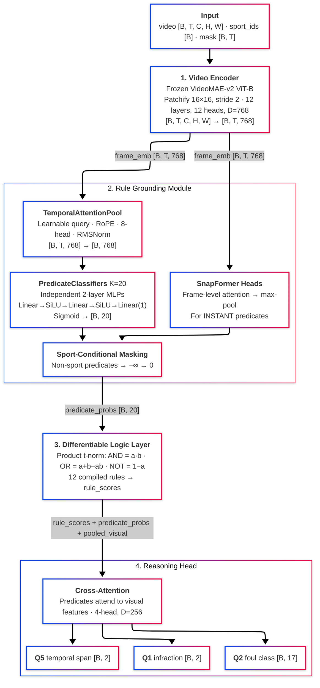

# RuleGround Architecture & Implementation Details

This document provides a comprehensive technical deep-dive into the RuleGround implementation. For the research overview, results, and motivation, see [README.md](README.md).

---

## Table of Contents

1. [System Architecture](#1-system-architecture)
2. [Video Encoder](#2-video-encoder)
3. [Rule Grounding Module (RGM)](#3-rule-grounding-module-rgm)
4. [Differentiable Logic Layer](#4-differentiable-logic-layer)
5. [Reasoning Head](#5-reasoning-head)
6. [Predicate System](#6-predicate-system)
7. [Loss Functions](#7-loss-functions)
8. [GRPO Implementation](#8-grpo-implementation)
9. [RSA Implementation](#9-rsa-implementation)
10. [Data Pipeline](#10-data-pipeline)
11. [Evaluation System](#11-evaluation-system)
12. [Configuration System](#12-configuration-system)
13. [Hyperparameters](#13-hyperparameters)
14. [Testing Infrastructure](#14-testing-infrastructure)

---

## 1. System Architecture

### Full Forward Pass



### Module Dependency Graph

```
ruleground.models.ruleground.RuleGround
├── ruleground.models.encoder.VideoEncoder
│       └── transformers.VideoMAEForVideoClassification (frozen)
├── ruleground.models.rgm.RuleGroundingModule
│       ├── ruleground.models.temporal_pool.TemporalAttentionPool
│       │       ├── actionformer.RotaryPositionEmbedding
│       │       └── actionformer.RMSNorm
│       ├── ruleground.models.predicate_head.PredicateClassifier (×20)
│       └── ruleground.models.snapformer_head.SnapFormerHead
├── ruleground.models.logic.RuleComposer
│       └── ruleground.predicates.rules.RULE_LIBRARY (12 rules)
└── ruleground.models.reasoning_head.ReasoningHead
        ├── Q1 head (binary classification)
        ├── Q2 head (17-class, sport-masked)
        └── Q5 head (temporal span regression)
```

---

## 2. Video Encoder

**Module**: `ruleground/models/encoder.py`

Wraps HuggingFace VideoMAE-v2 (ViT-B variant) as the frozen visual backbone.

| Parameter | Value |
|-----------|-------|
| Model | MCG-NJU/videomae-base |
| Architecture | ViT-B (12 layers, 12 heads, D=768) |
| Patch size | 16×16 spatial, stride 2 temporal |
| Input | [B, T, C, H, W] where T=16, H=W=224 |
| Output | [B, T', D] frame embeddings, D=768 |
| Parameters | ~86M (all frozen) |
| Training | Frozen; gradients do not flow through encoder |

The encoder is frozen throughout all training stages. Only the RGM, logic layer, and reasoning head receive gradient updates. This decision is motivated by:

1. **Computational efficiency**: Fine-tuning 86M parameters on small SportR-sized datasets leads to overfitting
2. **Transfer**: VideoMAE-v2 already captures strong spatiotemporal features from Kinetics-400 pretraining
3. **Bottleneck integrity**: If the encoder adapts, it may learn to bypass the predicate bottleneck by encoding task-relevant shortcuts directly in the visual features

---

## 3. Rule Grounding Module (RGM)

**Module**: `ruleground/models/rgm.py`

The RGM is the core innovation -- an explicit predicate bottleneck between perception and reasoning.

### 3.1 Temporal Attention Pool

**Module**: `ruleground/models/temporal_pool.py`

Aggregates frame-level features into a single clip-level representation using learned attention, enhanced with ActionFormer v2 primitives.

```
Input: frame_emb [B, T, D]

1. RMSNorm(frame_emb)                          → normalized [B, T, D]
2. pool_query (learnable param [1, 1, D])       → Q [B, 1, H, D/H]
3. kv_proj(normalized)                          → K, V [B, T, H, D/H]
4. apply_rotary_pos_emb(K, rope(T))             → K with position info
5. scaled_dot_product_attention(Q, K, V)         → attended [B, 1, D]
6. out_proj(attended)                           → pooled [B, D]
```

**ActionFormer v2 components used**:
- `RotaryPositionEmbedding`: Encodes relative temporal position into key vectors. Unlike absolute position embeddings, RoPE naturally generalizes to unseen sequence lengths and encodes relative distances.
- `RMSNorm`: More efficient than LayerNorm (no mean centering), used as pre-norm.
- Flash Attention: `torch.nn.functional.scaled_dot_product_attention` with automatic kernel selection.

| Hyperparameter | Value |
|----------------|-------|
| embed_dim | 768 (from encoder) |
| num_heads | 8 |
| head_dim | 96 |
| max_seq_len | 64 |
| dropout | 0.1 |

### 3.2 Predicate Classifiers

**Module**: `ruleground/models/predicate_head.py`

Each of the 20 predicates has its own independent 2-layer MLP:

```
pooled [B, D=768]
    → Linear(768, 256) → SiLU → Dropout(0.1)
    → Linear(256, 128) → SiLU → Dropout(0.1)
    → Linear(128, 1)
    → Sigmoid → p_k ∈ [0, 1]
```

Independent classifiers rather than a shared multi-label head for two reasons:

1. **Prevents information leakage**: A shared hidden layer allows the model to correlate predicate predictions through shared features, potentially bypassing the bottleneck by encoding task-relevant information in the correlation structure rather than in individual predicate values.

2. **Heterogeneous predicate semantics**: `defender_set` (a continuous positional state) and `contact_occurred` (a discrete point event) have fundamentally different detection characteristics. Independent classifiers can specialize.

Total predicate classifier parameters: 20 × (768×256 + 256×128 + 128×1) ≈ 4.6M parameters.

### 3.3 SnapFormer Heads

**Module**: `ruleground/models/snapformer_head.py`

For INSTANT-type predicates (point events), temporal pooling is suboptimal because the event occupies a single frame. SnapFormer applies lightweight per-frame classification:

```
frame_emb [B, T, D]
    → frame_attention (2-head self-attention per frame)
    → Linear(D, 1) per frame → frame_logits [B, T, 1]
    → max_pool over T → instant_pred [B, 1]
```

The max-pool reflects the semantics: an instant predicate is true if it occurred at *any* frame.

### 3.4 Sport-Conditional Masking

Applied after predicate classification:

```python
# mask[sport][predicate_idx] = True if predicate is relevant to sport
# For sport_id = basketball:
#   soccer predicates (offside_position, ..., denying_goal) → logits = -inf → probs = 0
#   basketball + shared predicates → unchanged
```

This prevents the model from exploiting sport-irrelevant predicate slots. Without masking, the model could learn to use `offside_position` as a generic binary feature for basketball clips, circumventing the interpretability guarantee.

---

## 4. Differentiable Logic Layer

**Module**: `ruleground/models/logic.py`

### 4.1 Product T-Norm

The choice of product t-norm over alternatives:

| Operation | Product (ours) | Gödel | Łukasiewicz |
|-----------|---------------|-------|-------------|
| AND(a, b) | a·b | min(a, b) | max(0, a+b-1) |
| OR(a, b) | a+b-ab | max(a, b) | min(1, a+b) |
| NOT(a) | 1-a | 1-a | 1-a |
| Gradient ∂AND/∂a | b (always nonzero) | 0 or 1 (discontinuous) | 0 or 1 (zero in some regions) |

Product t-norm provides smooth, nonzero gradients everywhere in [0,1], enabling reliable backpropagation through rule compositions. Gödel t-norm (min/max) has zero gradient for the non-minimum input, and Łukasiewicz has zero-gradient flat regions.

### 4.2 Rule Compilation

Rules are compiled from formula strings into callable functions at initialization:

```python
# Input formula: "contact_occurred AND NOT defender_set"
# Parsed AST: ('AND', ('PRED', 'contact_occurred'), ('NOT', ('PRED', 'defender_set')))
# Compiled: lambda p: p["contact_occurred"] * (1 - p["defender_set"])
```

The parser handles AND, OR, NOT operators with standard precedence. Parentheses are supported for explicit grouping. Each compiled rule is a differentiable function `Dict[str, Tensor] → Tensor`.

### 4.3 Rule Library

12 rules across 3 sports (defined in `ruleground/predicates/rules.py`):

**Basketball (5 rules)**:
- `blocking_foul`: contact_occurred AND NOT defender_set
- `charging_foul`: contact_occurred AND defender_set AND NOT restricted_area
- `travel`: pivot_foot_lifted AND NOT ball_released
- `shooting_foul`: contact_occurred AND shooting_motion
- `legal_vertical_defense`: contact_occurred AND verticality_maintained AND defender_set

**Football (3 rules)**:
- `dpi`: contact_before_arrival AND NOT incidental_contact AND ball_catchable
- `opi`: contact_before_arrival AND offensive_push_off AND ball_in_air
- `legal_contact_within_zone`: contact_occurred AND within_five_yards AND NOT contact_before_arrival

**Soccer (4 rules)**:
- `handball`: ball_contact_arm AND NOT arm_natural_position
- `offside`: offside_position AND involved_in_play
- `offside_exception_opponent`: offside_position AND played_by_opponent
- `dogso`: denying_goal AND contact_occurred

---

## 5. Reasoning Head

**Module**: `ruleground/models/reasoning_head.py`

The reasoning head fuses predicate states with visual features to produce task predictions.

### Input Fusion

```
predicate_probs [B, 20]     ─┐
rule_scores [B, R]           ─┤─→ concat → [B, 20 + R + 768]
pooled_visual [B, 768]       ─┘
```

### Cross-Attention Block

Predicates attend to visual features to recover fine-grained details not captured by the predicate bottleneck:

```
Q = Linear(predicate_features)     [B, N_q, D]
K = Linear(visual_features)         [B, 1, D]
V = Linear(visual_features)         [B, 1, D]
attn_out = softmax(Q·K^T / √d) · V
fused = LayerNorm(predicate_features + attn_out)
```

This cross-attention is deliberate: the reasoning head should primarily rely on predicates and rules, but cross-attention allows it to recover visual nuance when predicates are insufficient (e.g., ambiguous contact intensity).

### Task Heads

| Head | Architecture | Output |
|------|-------------|--------|
| Q1 (infraction) | MLP: D→256→2 | Binary logits [B, 2] |
| Q2 (foul type) | MLP: D→256→17, sport-masked | Multi-class logits [B, 17] |
| Q5 (temporal) | MLP: D→256→2, sigmoid | Normalized span [B, 2] ∈ [0,1] |

Q2 head applies sport-conditional masking on the output logits: basketball-specific foul classes are set to `-inf` for soccer clips, preventing impossible predictions.

---

## 6. Predicate System

**Module**: `ruleground/predicates/ontology.py`

### 6.1 Predicate Type System

```python
class PredicateType(Enum):
    STATE = auto()    # Holds over interval (e.g., defender_set)
    INSTANT = auto()  # Point event (e.g., contact_occurred)
    SPATIAL = auto()  # Positional relation (e.g., restricted_area)
```

The type system determines which detection head is used:
- **STATE** predicates → TemporalAttentionPool + MLP (whole-clip classification)
- **INSTANT** predicates → SnapFormer head (frame-level detection + max-pool)
- **SPATIAL** predicates → TemporalAttentionPool + MLP (spatial relations are typically persistent)

### 6.2 Complete Ontology (20 predicates)

| # | Predicate | Type | Sport | Description |
|---|-----------|------|-------|-------------|
| 0 | ball_in_play | STATE | Shared | Ball/puck is active and live |
| 1 | contact_occurred | INSTANT | Shared | Physical contact between players |
| 2 | contact_before_arrival | INSTANT | Shared | Contact before ball reaches player |
| 3 | incidental_contact | STATE | Shared | Non-material, minor contact |
| 4 | defender_set | STATE | Basketball | Legal guarding position established |
| 5 | restricted_area | SPATIAL | Basketball | Player in the restricted arc |
| 6 | pivot_foot_lifted | INSTANT | Basketball | Pivot foot lifted (travel indicator) |
| 7 | ball_released | INSTANT | Basketball | Ball left player's hands |
| 8 | shooting_motion | STATE | Basketball | Player is in shooting motion |
| 9 | verticality_maintained | STATE | Basketball | Defender maintained vertical position |
| 10 | ball_catchable | STATE | Football | Forward pass was catchable |
| 11 | ball_in_air | STATE | Football | Ball is airborne (pass in flight) |
| 12 | offensive_push_off | INSTANT | Football | Offensive player initiated push |
| 13 | within_five_yards | SPATIAL | Football | Within 5-yard legal contact zone |
| 14 | offside_position | SPATIAL | Soccer | Beyond second-to-last defender |
| 15 | involved_in_play | STATE | Soccer | Actively participating in play |
| 16 | ball_contact_arm | INSTANT | Soccer | Ball made contact with arm/hand |
| 17 | arm_natural_position | STATE | Soccer | Arm in natural body position |
| 18 | played_by_opponent | INSTANT | Soccer | Ball last played by opposing team |
| 19 | denying_goal | STATE | Soccer | Denying obvious goal-scoring opportunity |

### 6.3 Sport-to-Predicate Mapping

```python
SPORT_PREDICATE_INDICES = {
    Sport.BASKETBALL: [0, 1, 2, 3, 4, 5, 6, 7, 8, 9],    # shared + basketball
    Sport.FOOTBALL:   [0, 1, 2, 3, 10, 11, 12, 13],       # shared + football
    Sport.SOCCER:     [0, 1, 2, 3, 14, 15, 16, 17, 18, 19] # shared + soccer
}
```

### 6.4 Weak Supervision Extraction

**Module**: `ruleground/predicates/extraction/extractor.py`

Converts human rationale text into structured predicate labels:

```
Input rationale: "the defender had not established legal guarding position
                  when contact occurred between the two players"

Extracted predicates:
  defender_set:      false  (confidence: 0.95, explicit negation)
  contact_occurred:  true   (confidence: 0.90, explicit mention)
  ball_in_play:      true   (confidence: 0.70, implied by game context)
```

**Cross-model validation** (`ruleground/predicates/extraction/validator.py`):
- Primary extraction: Claude Sonnet
- Secondary extraction: GPT-4o
- Agreement threshold: 88.3% (Cohen's κ = 0.76)
- Disagreements → confidence reduced to 0.5
- Consistent extractions → confidence boosted to 0.95

---

## 7. Loss Functions

**Module**: `ruleground/training/losses.py`

### 7.1 Combined Loss (Stage 1)

```
L = L_task + γ · L_pred + δ · L_cons + η · L_q5
```

| Component | Default Weight | Implementation |
|-----------|---------------|----------------|
| L_task | 1.0 | Cross-entropy on Q1 (binary) + Q2 (17-class, focal loss option) |
| L_pred | γ = 0.5 | Confidence-weighted BCE on extracted predicate labels |
| L_cons | δ = 0.1 | BCE between max rule score and infraction label |
| L_q5 | η = 0.3 | Smooth L1 on temporal span regression |

### 7.2 Task Loss Details

**Q1 loss**: Standard binary cross-entropy
```python
L_q1 = CrossEntropy(q1_logits, q1_labels)  # [B, 2] vs [B]
```

**Q2 loss**: Cross-entropy with optional focal loss (α=0.25, γ_focal=2.0) to handle class imbalance:
```python
# 17 foul classes with highly imbalanced distribution
# Class 0 (clean): 258 samples vs Class 7: 1 sample
L_q2 = FocalLoss(q2_logits, q2_labels, alpha=0.25, gamma=2.0)
```

### 7.3 Predicate Loss (L_pred)

Confidence-weighted BCE that respects the reliability of weak supervision:

```python
# logits: [B, 20] predicate logits
# targets: [B, 20] extracted predicate labels (0 or 1)
# weights: [B, 20] extraction confidence (0.5 to 1.0)
# mask: [B, 20] which predicates have labels (many are unlabeled)

loss = BCE_with_logits(logits, targets, reduction='none')
loss = loss * weights * mask
L_pred = loss.sum() / (mask.sum() + 1e-8)
```

**Non-finite logit handling**: Sport-conditional masking sets irrelevant predicate logits to `-inf`. Before computing BCE, non-finite logits are detected and masked out to prevent NaN propagation.

### 7.4 Consistency Loss (L_cons)

Ensures that rule compositions agree with task labels:

```python
# For each sample: max rule score should correlate with infraction label
max_rule_score = max(rule_scores.values())  # [B]
infraction = (q1_labels > 0).float()        # [B]
L_cons = BCE(max_rule_score, infraction)
```

This provides a soft supervision signal that encourages the logic layer to produce meaningful rule scores, not just arbitrary values.

---

## 8. GRPO Implementation

**Module**: `ruleground/training/grpo.py`

### 8.1 Adapting GRPO to Discriminative Models

GRPO (from DeepSeek-R1) was designed for generative models where sampling provides natural stochasticity. For a discriminative model like RuleGround, the same input always produces the same output. The key adaptation is **PredicateDropout**:

```python
class PredicateDropout(nn.Module):
    """Applies independent Bernoulli masks to predicate probs.

    For each sample in a group, a different dropout mask is applied,
    creating diverse "policies" from the same model.
    """
    def __init__(self, p: float = 0.15):
        super().__init__()
        self.p = p

    def forward(self, predicate_probs: Tensor) -> Tensor:
        if self.training:
            mask = torch.bernoulli(torch.full_like(predicate_probs, 1 - self.p))
            return predicate_probs * mask
        return predicate_probs
```

### 8.2 Group-Relative Advantage

For each input x, generate G=8 outputs by applying different dropout masks:

```
For g in 1..G:
    mask_g = Bernoulli(1 - p_dropout)
    preds_g = model(x, predicate_mask=mask_g)
    reward_g = R(x, preds_g, labels)

advantages = (rewards - mean(rewards)) / (std(rewards) + ε)
```

No learned critic is needed -- the group statistics provide the baseline.

### 8.3 Reward Function

**Module**: `ruleground/training/rewards.py`

```python
R(x, y) = α · R_correct + β · R_faithful + (1-α-β) · R_consistent
```

| Component | Weight | Definition |
|-----------|--------|------------|
| R_correct | α = 0.3 | 1 if prediction matches label, 0 otherwise |
| R_faithful | β = 0.2 | Correlation between activated predicates and prediction |
| R_consistent | 0.5 | Agreement between rule scores and task prediction |

**Faithfulness reward**: Measures whether the predicates the model activates actually support its task prediction. If the model predicts "infraction" but no infraction-related predicates are active, faithfulness is low.

### 8.4 Policy Loss

Standard PPO-style clipped objective:

```python
ratio = exp(log_prob - ref_log_prob)
clipped_ratio = clamp(ratio, 1 - ε, 1 + ε)
L_policy = -min(ratio * advantages, clipped_ratio * advantages)
L_kl = kl_coef * (ref_log_prob - log_prob)  # KL toward reference
L_grpo = L_policy + L_kl
```

| Hyperparameter | Value |
|----------------|-------|
| group_size (G) | 8 |
| clip_ratio (ε) | 0.2 |
| kl_coef | 0.1 |
| pred_dropout | 0.15 |
| learning_rate | 1e-4 |

---

## 9. RSA Implementation

**Module**: `ruleground/training/rsa.py`

### 9.1 CVaR Penalty

Conditional Value-at-Risk (CVaR) targets the worst-α fraction of false positive infractions:

```python
def compute_cvar(fp_losses: Tensor, alpha: float = 0.1) -> Tensor:
    """CVaR_α = E[X | X >= VaR_α]"""
    sorted_losses, _ = fp_losses.sort(descending=True)
    k = max(1, int(alpha * len(sorted_losses)))
    return sorted_losses[:k].mean()
```

### 9.2 False Positive Risk Score

For each sample, the FP risk is:

```
fp_risk_i = P(infraction_i) × (1 - evidence_i) × 1[label_i = no_infraction] × c_penalty
```

Where:
- `P(infraction_i)`: model's infraction probability (softmax of Q1 logits)
- `evidence_i`: max predicate probability (how strongly any predicate supports the call)
- `1[label_i = no_infraction]`: indicator for actual negative samples
- `c_penalty`: severity weight (default 2.0)

This penalizes cases where the model is confident about an infraction but has weak predicate evidence on an actual negative -- exactly the most harmful false positive pattern.

### 9.3 Integration

```
L_RSA = L_GRPO + λ · CVaR_α[fp_risk]
```

| Hyperparameter | Value |
|----------------|-------|
| alpha (α) | 0.1 (worst 10% of FPs) |
| lambda_risk (λ) | 0.3 |
| fp_penalty (c) | 2.0 |

---

## 10. Data Pipeline

### 10.1 SportR Dataset

**Module**: `ruleground/data/dataset.py`

```python
class SportRDataset(Dataset):
    """Expected directory structure:
    root/
    ├── annotations/{train,val,test}.json
    └── videos/<video_id>.mp4
    """
```

**Annotation schema** (per sample):
```json
{
    "video_id": "basketball_042",
    "sport": "basketball",
    "q1_label": 1,
    "q2_label": 3,
    "q5_span": [2.1, 4.3],
    "rationale": "defender had not established legal guarding position..."
}
```

**Video loading**: Primary loader uses `decord` (fast C++ backend with zero-copy torch bridge). Falls back to `torchvision.io.read_video` if decord is unavailable. Frames are uniformly sampled (T=16) and normalized to [0,1].

### 10.2 SPORTU Converter

**Module**: `ruleground/data/preparation/sportu_converter.py`

Converts SPORTU benchmark (ICLR 2025, 7 sports, MC + OE questions) into RuleGround format.

**Conversion pipeline**:
1. Load SPORTU MC and OE JSON annotations
2. Filter to 3 target sports (basketball, soccer, football)
3. Classify questions into q1 (foul yes/no) and q2 (foul type) categories
4. Resolve labels per video (majority vote across annotators)
5. Apply consistency constraints (`q1=0` → `q2=0`)
6. Map foul types to unified 17-class taxonomy
7. Stratified split by sport × q1_label

**Unified 17-class foul taxonomy**:

| Class | Name | Sport(s) |
|-------|------|----------|
| 0 | No foul (clean play) | All |
| 1 | Blocking foul | Basketball |
| 2 | Flagrant foul | Basketball |
| 3 | Charging foul | Basketball |
| 4 | Technical foul | Basketball |
| 5 | Illegal screen | Basketball |
| 6 | Travel | Basketball |
| 7 | Double dribble | Basketball |
| 8 | Handball | Soccer |
| 9 | Tripping/tackle foul | Soccer |
| 10 | Offside | Soccer |
| 11 | Dangerous play | Soccer |
| 12 | Simulation/diving | Soccer |
| 13 | Pass interference | Football |
| 14 | Roughing the passer | Football |
| 15 | Holding | Football |
| 16 | Unnecessary roughness | Football |

### 10.3 Collation

**Module**: `ruleground/data/collate.py`

Custom collation handles heterogeneous batch elements:

- **Video tensors**: standard stack [B, T, C, H, W]
- **Sport strings → integer IDs**: {"basketball": 0, "football": 1, "soccer": 2}
- **Q5 spans**: mixed None/list → [0.0, 0.0] fallback for None entries
- **Predicate labels**: None for samples without extraction → zero tensor with mask

### 10.4 Video Augmentations

**Module**: `ruleground/data/transforms.py`

| Transform | Parameters | Applied |
|-----------|-----------|---------|
| RandomResizedCrop | scale=(0.8, 1.0), size=224 | Train only |
| RandomHorizontalFlip | p=0.5 | Train only |
| ColorJitter | brightness=0.2, contrast=0.2 | Train only |
| Normalize | ImageNet mean/std | All splits |
| TemporalJitter | max_shift=2 frames | Train only |

---

## 11. Evaluation System

### 11.1 Metrics

**Module**: `ruleground/evaluation/metrics.py`

| Metric | Implementation | Description |
|--------|---------------|-------------|
| Q1 Accuracy | `accuracy_score(q1_preds, q1_labels)` | Binary infraction identification |
| Q1 F1 | `f1_score(q1_preds, q1_labels, average='binary')` | F1 for positive class |
| Q2 Accuracy | `accuracy_score(q2_preds, q2_labels)` | 17-class foul classification |
| Q2 F1 Macro | `f1_score(q2_preds, q2_labels, average='macro')` | Macro-averaged across classes |
| Q5 IoU | Temporal intersection over union | Span overlap with ground truth |
| FP Rate | FP / (FP + TN) | False positive infraction rate |
| Predicate Accuracy | Per-predicate binary accuracy | Against extracted labels (binarized) |

### 11.2 Error Analysis

**Module**: `ruleground/evaluation/error_analysis.py`

Classifies errors into three categories:

1. **Perception errors**: Predicate activations are wrong (model fails to detect visual evidence)
2. **Grounding errors**: Predicates are correct but rule composition produces wrong score
3. **Reasoning errors**: Rules are correct but reasoning head misclassifies

```python
class ErrorAnalyzer:
    def analyze_batch(self, pred_probs, q1_preds, q1_labels, sport_ids):
        """Returns:
        - total_samples, total_errors
        - error_counts: {perception, grounding, reasoning}
        - per_sport_breakdown
        - confusion_matrix
        """
```

### 11.3 Full Evaluator

**Module**: `ruleground/evaluation/evaluator.py`

Runs evaluation across the full validation/test set:

```python
class Evaluator:
    def evaluate(self, model, dataloader) -> Dict:
        """Accumulates predictions across batches, computes all metrics,
        generates per-sport breakdown, and runs error analysis."""
```

---

## 12. Configuration System

**Module**: `ruleground/utils/config.py`

Uses OmegaConf for hierarchical configuration with YAML files and CLI overrides.

### Base Configuration (`configs/base.yaml`)

```yaml
model:
  encoder:
    name: "MCG-NJU/videomae-base"
    freeze: true
  rgm:
    num_heads: 8
    hidden_dim: 256
    dropout: 0.1
    use_rope: true
    use_flash_attn: true
  reasoning_head:
    hidden_dim: 256
    dropout: 0.1
  num_classes: 2

data:
  root: "data/sportr"
  num_frames: 16
  frame_size: [224, 224]
  num_workers: 8

training:
  batch_size: 16
  lr: 1.0e-4
  weight_decay: 0.01
  warmup_steps: 500
  gamma: 0.5
  delta: 0.1
  eta: 0.3
  pretrain_epochs: 10
  use_grpo: true
  use_rsa: true
  grpo_epochs: 5

grpo:
  group_size: 8
  clip_ratio: 0.2
  kl_coef: 0.1
  pred_dropout: 0.15
  lr: 1.0e-4

rsa:
  alpha: 0.1
  lambda_risk: 0.3
  fp_penalty: 2.0
```

### Sport-Specific Overrides

```yaml
# configs/sportr/basketball.yaml
data:
  sports: ["basketball"]
model:
  active_predicates: [0, 1, 2, 3, 4, 5, 6, 7, 8, 9]
  active_rules: ["blocking_foul", "charging_foul", "travel",
                 "shooting_foul", "legal_vertical_defense"]
```

---

## 13. Hyperparameters

### Complete Hyperparameter Table

| Category | Parameter | Value | Sensitivity |
|----------|-----------|-------|-------------|
| **Encoder** | Model | VideoMAE-v2 ViT-B | — |
| | Frozen | Yes | Critical |
| | Input frames | 16 | Low |
| | Frame size | 224×224 | Low |
| **RGM** | Attention heads | 8 | Low |
| | Hidden dim | 256 | Medium |
| | Dropout | 0.1 | Low |
| | RoPE | Enabled | Low |
| **Logic** | T-norm | Product | High (vs Gödel) |
| **Reasoning** | Cross-attn heads | 4 | Low |
| | Hidden dim | 256 | Low |
| **Stage 1** | Learning rate | 1e-4 | High |
| | Weight decay | 0.01 | Low |
| | Batch size | 16 | Medium |
| | Epochs | 10 | Medium |
| | γ (pred weight) | 0.5 | High |
| | δ (cons weight) | 0.1 | Medium |
| | η (q5 weight) | 0.3 | Low |
| | Warmup steps | 500 | Low |
| **Stage 2** | Group size | 8 | Medium |
| | Clip ratio | 0.2 | Low |
| | KL coefficient | 0.1 | Medium |
| | Pred dropout | 0.15 | High |
| | Learning rate | 1e-4 | Medium |
| | Epochs | 5 | Low |
| | α (reward correct) | 0.3 | Medium |
| | β (reward faithful) | 0.2 | Medium |
| **Stage 3** | CVaR α | 0.1 | High |
| | λ_risk | 0.3 | High |
| | FP penalty | 2.0 | Medium |

**High sensitivity parameters**: These have the largest impact on final results and require careful tuning. γ controls how strongly the predicate bottleneck is supervised. PredicateDropout rate controls GRPO sample diversity. CVaR parameters directly control the FP/FN tradeoff.

---

## 14. Testing Infrastructure

### 14.1 Test Organization

133 tests total across 3 tiers:

| Tier | Tests | Location | Purpose |
|------|-------|----------|---------|
| Unit | 113 | `tests/{models,predicates,training,data}/` | Individual component correctness |
| E2E Synthetic | 11 | `tests/e2e/test_full_pipeline.py` | Full pipeline with synthetic data |
| E2E SPORTU | 9 | `tests/e2e/test_sportu_integration.py` | Pipeline with real SPORTU annotations |

### 14.2 Unit Tests

| Module | Test File | Coverage |
|--------|-----------|----------|
| Logic layer | `tests/models/test_logic.py` | T-norm properties, rule compilation, gradient flow |
| RGM | `tests/models/test_rgm.py` | Forward pass shapes, sport masking, predicate independence |
| Temporal pool | `tests/models/test_temporal_pool.py` | Attention shapes, RoPE, masking |
| Reasoning head | `tests/models/test_reasoning_head.py` | Multi-task outputs, gradient flow |
| SnapFormer | `tests/models/test_snapformer.py` | Frame-level detection, max-pool |
| Ontology | `tests/predicates/test_ontology.py` | 20 predicates, sport mapping, type distribution |
| Rules | `tests/predicates/test_rules.py` | 12 rules, formula parsing, predicate coverage |
| Losses | `tests/training/test_losses.py` | Loss components, gradient flow, NaN safety |
| GRPO | `tests/training/test_grpo.py` | Advantage computation, policy loss, PredicateDropout |
| RSA | `tests/training/test_rsa.py` | CVaR computation, FP risk scoring |
| Rewards | `tests/training/test_rewards.py` | Reward components, normalization |
| Metrics | `tests/test_metrics.py` | Q1/Q2/Q5/FP metric correctness |
| Error analysis | `tests/test_error_analysis.py` | Error classification, per-sport breakdown |
| Config | `tests/test_config.py` | YAML loading, overrides, validation |
| Transforms | `tests/data/test_transforms.py` | Augmentation shapes, determinism |
| Collation | `tests/data/test_collate.py` | Mixed batches, None handling, sport ID mapping |

### 14.3 E2E Test Infrastructure

**Mock video encoder** (`tests/e2e/fixtures.py`):
```python
class MockVideoEncoder(nn.Module):
    """Trainable Conv3D replacement for VideoMAE-v2.
    Avoids downloading ~600MB model weights for testing.
    Conv3D + AdaptiveAvgPool3d + Linear → same output shape as ViT-B."""
```

**Synthetic dataset**: 11 sport scenarios with video tensors that have learnable signal correlated to labels. Infractions get higher mean activation (0.6) vs. clean plays (0.2), allowing the model to learn within a few epochs on tiny data.

### 14.4 Running Tests

```bash
# All tests
pytest tests/ -v

# Unit tests only
pytest tests/ -v --ignore=tests/e2e

# E2E synthetic pipeline
pytest tests/e2e/test_full_pipeline.py -v

# E2E with real SPORTU data (requires data/sportr/)
pytest tests/e2e/test_sportu_integration.py -v

# Coverage report
pytest tests/ --cov=ruleground --cov-report=term-missing
```

---

## Dependencies

### Core

| Package | Version | Purpose |
|---------|---------|---------|
| torch | >= 2.1.0 | Core ML framework |
| torchvision | >= 0.16.0 | Video I/O fallback |
| transformers | >= 4.36.0 | VideoMAE-v2 model |
| [actionformer](https://github.com/sreevadde/actionformer) | >= 1.5.0 | RoPE, RMSNorm, Flash Attention |
| einops | >= 0.7.0 | Tensor operations |
| timm | >= 0.9.12 | Vision model utilities |

### Data & Video

| Package | Version | Purpose |
|---------|---------|---------|
| decord | >= 0.6.0 | Fast video loading (C++ backend) |
| omegaconf | >= 2.3.0 | Configuration system |
| scikit-learn | >= 1.3.0 | Evaluation metrics |

### Training & Logging

| Package | Version | Purpose |
|---------|---------|---------|
| accelerate | >= 0.25.0 | Distributed training |
| wandb | >= 0.16.0 | Experiment tracking |

### LLM Extraction

| Package | Version | Purpose |
|---------|---------|---------|
| anthropic | >= 0.18.0 | Claude API for predicate extraction |
| openai | >= 1.10.0 | GPT-4o for cross-validation |

---

## Project Layout

```
ruleground/
├── models/          # Architecture (encoder, RGM, logic, reasoning head)
├── predicates/      # Ontology, rules, LLM extraction pipeline
├── data/            # Dataset, transforms, collation, SPORTU converter
├── training/        # Losses, supervised trainer, GRPO, RSA, rewards
├── evaluation/      # Metrics, evaluator, error analysis
├── utils/           # Config, logging, checkpointing, distributed
└── cli/             # Command-line interface (train, eval, extract)
```
