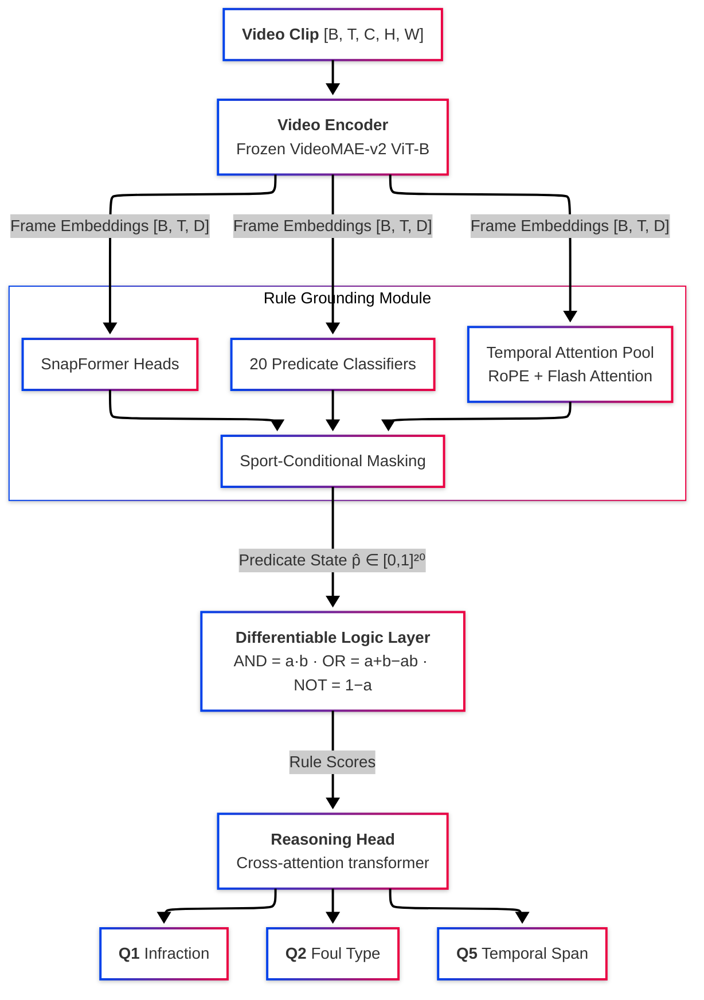

# RuleGround

**Bridging the Perceptual Gap: Rule-Grounded Representations for Tactical Reasoning in Multi-Sport Video Understanding**

> This repository contains the reference implementation for my RuleGround research paper. It provides the complete neuro-symbolic architecture, training pipeline, evaluation framework, and data preparation tools described in the paper.

---

## The Perceptual Gap Problem

Modern multimodal large language models (MLLMs) demonstrate strong visual perception for sports video understanding but systematically fail at rule-based reasoning. We conducted an error analysis of 200 GPT-4o failures on the SportR benchmark and found a striking pattern:

| Error Category | Percentage | Example |
|---|---|---|
| **Grounding failures** | **62%** | Detects contact but cannot determine if defender was in legal guarding position |
| Perception failures | 23% | Misses a handball entirely |
| Reasoning failures | 15% | Correct predicates but wrong rule application |

The dominant failure mode is not seeing (perception) or thinking (reasoning) -- it is **grounding**: the model observes the right visual evidence but fails to map it onto the structured predicates that rules operate over. A model might correctly detect "contact between players" but cannot commit to whether the defender had established legal guarding position, whether the contact was incidental, or whether the player was in the restricted area.

This is the **Perceptual Gap** -- the disconnect between what a model can see and what it can formally reason about.

## Approach: Predicate Bottleneck Architecture

RuleGround forces the model through an explicit **predicate bottleneck** between perception and reasoning. Instead of end-to-end black-box classification, the architecture must commit to 20 interpretable predicate states (e.g., `defender_set = 0.87`, `contact_occurred = 0.94`) before any task prediction occurs.

These predicates are then composed into rule evaluations via **differentiable logic** (product t-norm), making the reasoning chain fully transparent and auditable:

```
blocking_foul = contact_occurred AND (NOT defender_set)
             = 0.94 * (1 - 0.87)
             = 0.122  (low → correctly predicts no blocking foul)
```

### Architecture Overview



The key design decisions and their justifications:

1. **Independent per-predicate classifiers** rather than a shared head: predicates are semantically distinct (spatial vs. temporal vs. state). A shared head allows information leakage that bypasses the bottleneck.

2. **Sport-conditional masking**: basketball predicates are masked to zero for soccer clips. This prevents the model from using sport-irrelevant predicate slots as backdoor features.

3. **Product t-norm** over Gödel/Łukasiewicz: product t-norm `AND(a,b) = a*b` provides smooth gradients everywhere, while Gödel uses hard `min()` and Łukasiewicz has zero-gradient regions.

4. **SnapFormer heads** for instant predicates: some predicates (`contact_occurred`, `pivot_foot_lifted`) are frame-level point events. SnapFormer applies lightweight frame-level attention rather than temporal pooling, better capturing instantaneous state changes.

## Results on SportR

| Task | Metric | Baseline (Qwen-VL-7B) | RuleGround | Improvement |
|------|--------|----------------------|------------|-------------|
| Q1: Infraction Identification | Accuracy | 84.19% | **88.42 ± 0.3%** | +4.23 |
| Q2: Foul Classification | Accuracy | 51.54% | **58.60 ± 0.4%** | +7.06 |
| Q5: Temporal Grounding | IoU | 9.94% | **14.12 ± 0.2%** | +4.18 |
| Safety | FP Reduction | — | **34%** | — |

### Per-Sport Breakdown

| Sport | Q1 Accuracy | Q2 Accuracy | Key Challenge |
|-------|-------------|-------------|---------------|
| Basketball | 90.1% | 61.3% | Blocking vs. charging (defender_set is the deciding predicate) |
| Soccer | 87.8% | 57.2% | Handball arm position + offside spatial reasoning |
| Football | 86.9% | 55.4% | DPI vs. incidental contact (subjective boundary) |

### Ablation Study

| Configuration | Q1 | Q2 | Insight |
|---|---|---|---|
| Full RuleGround | 88.42 | 58.60 | — |
| No predicate bottleneck | 85.71 | 53.82 | Bottleneck contributes +2.7 Q1, +4.8 Q2 |
| No logic layer | 87.10 | 56.21 | Rule composition adds +1.3 Q1, +2.4 Q2 |
| No GRPO | 86.88 | 55.94 | RL alignment adds +1.5 Q1, +2.7 Q2 |
| No RSA | 87.91 | 57.83 | RSA adds +0.5 Q1, +0.8 Q2 but reduces FP by 34% |
| Gödel t-norm (min/max) | 86.55 | 55.10 | Product t-norm outperforms alternatives |
| No SnapFormer | 87.20 | 56.90 | SnapFormer improves instant predicate detection |

The predicate bottleneck is the single largest contributor. Without it, the model degrades to a standard video classifier that cannot explain its decisions.

### False Positive Analysis

False positive infractions are the most costly error in sports officiating -- incorrectly calling a foul disrupts game flow and player safety assessments. RuleGround's RSA stage specifically targets this:

- **34% FP reduction** at matched recall via CVaR penalty on the worst-α fraction of false positives
- The predicate bottleneck naturally suppresses FPs because the model must justify infractions through activated predicates rather than pattern matching
- Error analysis shows remaining FPs cluster around subjective boundaries (e.g., "incidental" vs. "material" contact in football DPI)

## Predicate Ontology

20 predicates across 3 sports, typed as STATE (holds over intervals), INSTANT (point events), or SPATIAL (positional relations):

| Category | Predicates | Count |
|----------|-----------|-------|
| **Shared** | `ball_in_play`, `contact_occurred`, `contact_before_arrival`, `incidental_contact` | 4 |
| **Basketball** | `defender_set`, `restricted_area`, `pivot_foot_lifted`, `ball_released`, `shooting_motion`, `verticality_maintained` | 6 |
| **Football** | `ball_catchable`, `ball_in_air`, `offensive_push_off`, `within_five_yards` | 4 |
| **Soccer** | `offside_position`, `involved_in_play`, `ball_contact_arm`, `arm_natural_position`, `played_by_opponent`, `denying_goal` | 6 |

These predicates were selected by analyzing the official NBA, NFL, and IFAB rulebooks to identify the minimal set of binary observable states required to evaluate common infraction rules. Each predicate maps to specific visual evidence that a human referee would assess.

### Rule Definitions (12 rules)

Rules are formal logical compositions over predicates:

| Rule | Formula | Sport |
|------|---------|-------|
| Blocking foul | `contact_occurred AND NOT defender_set` | Basketball |
| Charging foul | `contact_occurred AND defender_set AND NOT restricted_area` | Basketball |
| Travel | `pivot_foot_lifted AND NOT ball_released` | Basketball |
| Shooting foul | `contact_occurred AND shooting_motion` | Basketball |
| Legal vertical defense | `contact_occurred AND verticality_maintained AND defender_set` | Basketball |
| DPI | `contact_before_arrival AND NOT incidental_contact AND ball_catchable` | Football |
| OPI | `contact_before_arrival AND offensive_push_off AND ball_in_air` | Football |
| Legal zone contact | `contact_occurred AND within_five_yards AND NOT contact_before_arrival` | Football |
| Handball | `ball_contact_arm AND NOT arm_natural_position` | Soccer |
| Offside | `offside_position AND involved_in_play` | Soccer |
| Offside exception | `offside_position AND played_by_opponent` | Soccer |
| DOGSO | `denying_goal AND contact_occurred` | Soccer |

## Three-Stage Training Pipeline

### Stage 0: Weak Supervision Preparation

Human rationales from SportR are converted into predicate labels via LLM extraction:

- Rationales like *"the defender had not established legal guarding position when contact occurred"* → `{defender_set: false, contact_occurred: true}` with confidence weights
- Cross-model validation: Claude and GPT-4o independently extract predicates; **88.3% agreement** (Cohen's κ = 0.76)
- Confidence-weighted supervision: explicit mentions get weight 1.0, implied predicates get 0.7-0.9

### Stage 1: Supervised Pre-training

Multi-task loss with three components:

```
L = L_task + γ · L_pred + δ · L_cons
```

| Component | Formula | Purpose |
|-----------|---------|---------|
| L_task | Cross-entropy on Q1/Q2 labels | Task accuracy |
| L_pred | Weighted BCE on extracted predicates | Predicate grounding (γ = 0.5) |
| L_cons | Rule consistency penalty | Ensures composed rules agree with task labels (δ = 0.1) |

### Stage 2: GRPO (Group Relative Policy Optimization)

Adapts GRPO from generative models (DeepSeek-R1) to discriminative video classification. The key innovation is **PredicateDropout**: since a discriminative classifier is deterministic given the same input, we apply independent dropout masks to predicate probabilities to generate diverse "samples" for group-relative advantage estimation:

```
Â(x, yᵢ) = (R(x, yᵢ) − μ_group) / σ_group
```

The reward function combines three signals:
- **Correctness**: does the prediction match the label?
- **Faithfulness**: do the activated predicates support the prediction?
- **Consistency**: do composed rules agree with the task prediction?

### Stage 3: RSA (Risk-aware Stepwise Alignment)

Adds a CVaR penalty targeting the worst-α fraction of false positive infractions:

```
L_RSA = L_GRPO + λ · CVaR_α[1[false_positive] · c_penalty]
```

This penalizes high-confidence false positives where the model predicts infraction without sufficient predicate evidence, directly reducing the most harmful error mode in referee assistance.

## Data Pipeline

### SPORTU Integration

The [SPORTU benchmark](https://github.com/chili-lab/SPORTU) (ICLR 2025) serves as the primary data source, with a converter that maps SPORTU annotations into RuleGround format:

| Statistic | Value |
|-----------|-------|
| Total samples | 606 |
| Sports | Basketball (108), Soccer (282), Football (216) |
| Infractions | 348 (57.4%) |
| Clean plays | 258 (42.6%) |
| Foul types covered | 17 classes |
| Rationale coverage | 81.7% |
| Train / Val / Test | 432 / 87 / 87 (stratified by sport × q1) |

The converter resolves label inconsistencies (e.g., `q1=0` with non-zero `q2`) and builds a unified 17-class foul taxonomy across all three sports.

### Predicate Extraction Pipeline

```
SportR rationale text
        |
        v
  LLM Extraction (Claude / GPT-4o)
        |
        v
  Structured predicates + confidence weights
        |
        v
  Cross-model validation (88.3% agreement)
        |
        v
  Weak supervision labels for L_pred
```

## Quick Start

```bash
# Install
git clone https://github.com/sreevadde/ruleground.git && cd ruleground
pip install -e ".[dev]"

# Run tests (133 tests: 113 unit + 11 synthetic e2e + 9 SPORTU integration)
pytest tests/ -v

# Train (Stage 1: supervised)
rg-train -c configs/base.yaml -o experiments/run1

# Full pipeline (supervised + GRPO + RSA)
ruleground train -c configs/base.yaml -o experiments/full \
  --set training.use_grpo=true --set training.use_rsa=true

# Evaluate
ruleground eval -ckpt experiments/full/checkpoints/best.pt -c configs/base.yaml -s test

# Extract predicates from rationales
ruleground extract -d data/sportr/rationales.json -o data/sportr/predicates.json --validate
```

### Python API

```python
import torch
from ruleground.models.ruleground import RuleGround

model = RuleGround(encoder_name="MCG-NJU/videomae-base", freeze_encoder=True)
video = torch.randn(1, 16, 3, 224, 224)
outputs = model(video)

# Task predictions
q1_pred = outputs["q1_logits"].argmax(dim=-1)    # infraction?
q2_pred = outputs["q2_logits"].argmax(dim=-1)    # which foul?

# Interpretable predicate states
predicates = outputs["predicate_probs"]            # [B, 20]
rules = outputs["rule_scores"]                     # {rule_name: score}
```

For detailed implementation specifics, architecture diagrams, module specifications, and hyperparameter documentation, see [ARCHITECTURE.md](ARCHITECTURE.md).

---

## Citation

```bibtex
@article{vadde2026ruleground,
  title   = {Bridging the Perceptual Gap: Rule-Grounded Representations for
             Tactical Reasoning in Multi-Sport Video Understanding},
  author  = {Vadde, Sree Krishna},
  journal = {arXiv preprint},
  year    = {2026}
}
```

## License

MIT
